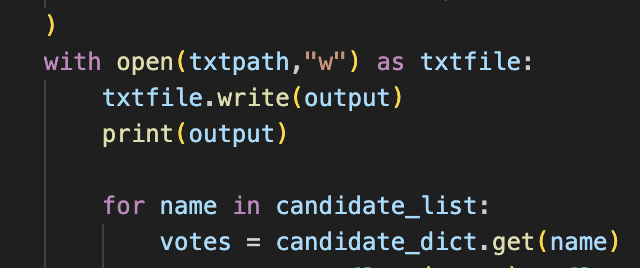
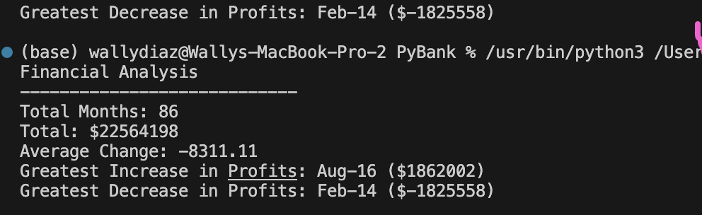

# Python Challenge

## Overview

In this respostiry we have 2 folders. One is to calculate election results and the other is to calculate banking results. We are using python with the csv libary using a csv reader funtion.

## Analysis

In pypoll we are reading in a csv file and processing in line elcetion resuts using list and dictionary to track individual candidates determining a winner and printing the results in terminal and file as seen in screenshot below.

  

## Results

In the pybank I calculate finacncial results from a csv file and used list and condition if statment to determine the month with the most profit and the least profit as seen in the image below.

  
